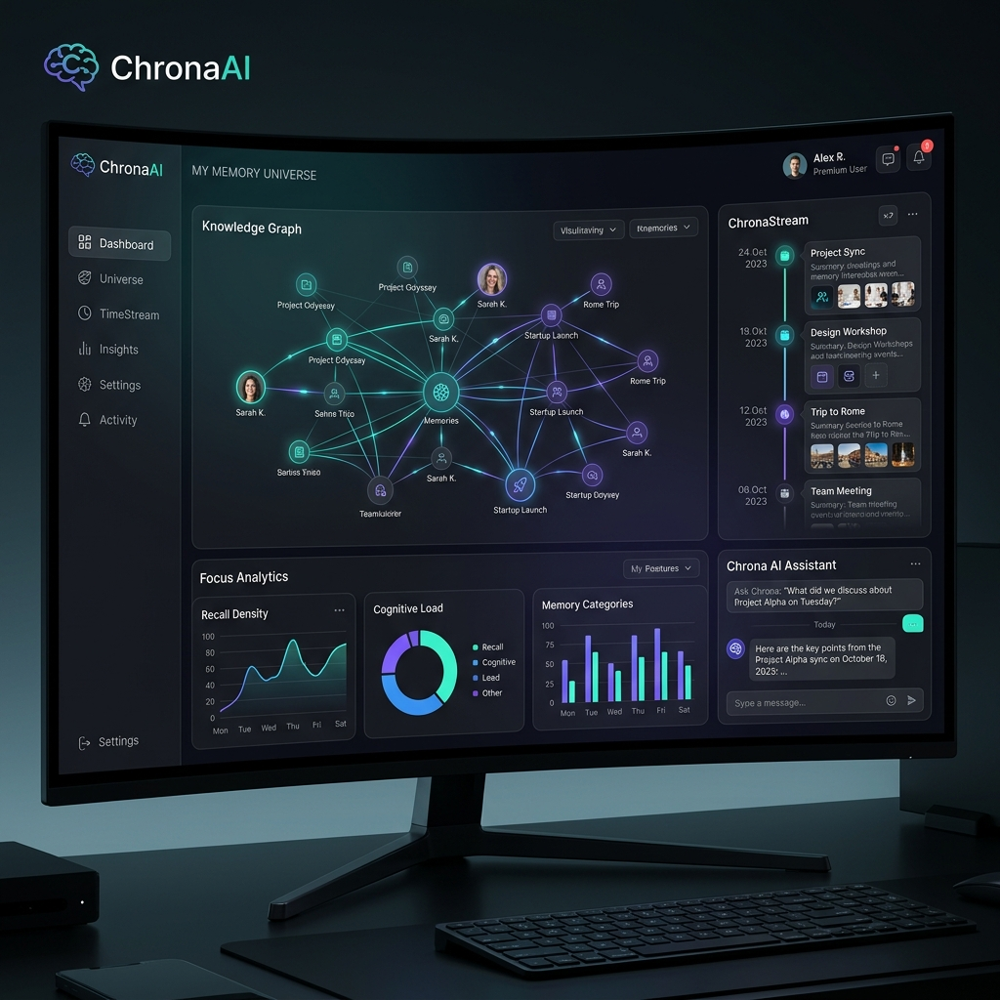
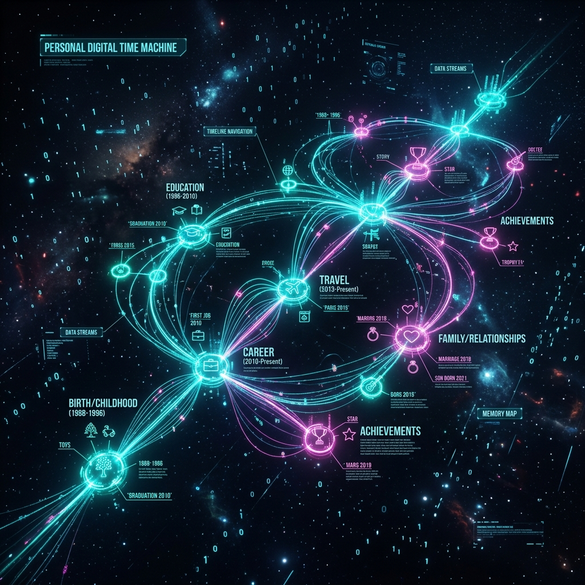

# ChronaAI

> **Travel Through Your Own Knowledge.**



ChronaAI is an original, production-grade Personal Digital Time Machine designed to record, understand, reconstruct, and predict your digital work history using local AI. 

Unlike traditional note-taking tools, ChronaAI operates as a local **AI Memory Operating System** that runs directly on your machine. It continuously observes your work activity and automatically builds a semantic memory timeline, a knowledge graph, and search indices—remaining fully offline-capable, extensible, and privacy-first.

---

## 🌌 Core Philosophy

**Never organize data into folders.** Instead, ChronaAI implements a continuous transformation pipeline:

$$\text{Events} \longrightarrow \text{Knowledge} \longrightarrow \text{Relationships} \longrightarrow \text{Timeline} \longrightarrow \text{Graph} \longrightarrow \text{Insights} \longrightarrow \text{Predictions}$$

Every file save, window switch, copy paste, or terminal command becomes a structured event that flows through our CQRS projections to feed your local timeline, knowledge graph, and vector search index.



---

## 🛠️ Architecture & Tech Stack

ChronaAI is built using **Clean Architecture** and **Domain-Driven Design (DDD)** combined with **Event Sourcing** and **CQRS (Command Query Responsibility Segregation)**.

```
                  ┌──────────────────────────────┐
                  │      Tauri / React App       │
                  └──────────────┬───────────────┘
                                 │ HTTP / WebSockets
                  ┌──────────────▼───────────────┐
                  │         FastAPI App          │
                  └──────────────┬───────────────┘
                                 │ Commands
                  ┌──────────────▼───────────────┐
                  │    PostgreSQL Event Store    │
                  └──────────────┬───────────────┘
                                 │ Dispatch (CQRS Projections)
        ┌────────────────────────┼────────────────────────┐
        ▼                        ▼                        ▼
┌──────────────┐          ┌──────────────┐         ┌──────────────┐
│  Neo4j Graph │          │ Qdrant Vector│         │ Tantivy Text │
└──────────────┘          └──────────────┘         └──────────────┘
```

### Stack Telemetry
- **Frontend**: React, TypeScript, Vite, TailwindCSS, React Query, Zustand, Framer Motion, Lucide React
- **Desktop Wrapper**: Tauri (Rust)
- **Backend API**: FastAPI (Python), Uvicorn, SQLAlchemy, Alembic, Dependency Injector
- **Databases & Engines**:
  - *Relational Event Store*: PostgreSQL (with automated fallback to local SQLite for zero-config deployments)
  - *Vector Search*: Qdrant (embedded serverless disk-storage mode)
  - *Knowledge Graph*: Neo4j Community (with automatic fallback to SQLite relational table representations)
  - *Cache*: Redis (with automatic fallback to local `diskcache`)
  - *Text Search*: Tantivy (embedded Rust search library, running serverlessly in-memory during test suites)
- **Local AI**: Ollama (for Embeddings & LLM), Tesseract OCR (for screen capture text extraction), Whisper.cpp, Moondream, Florence-2

---

## 📦 Project Structure

```
├── backend/
│   ├── app/
│   │   ├── core/           # Configuration, Dependency Injection Container (container.py, config.py)
│   │   ├── domain/         # Entities, Aggregates, Domain Events (events.py)
│   │   ├── infrastructure/ # DB clients, Search engines, OS Recorders, AI Agents
│   │   │   ├── agents/     # Specialized AI Agents (privacy, prediction, reflection, creative, etc.)
│   │   │   ├── database/   # Sqlite, Postgres event store models and projections
│   │   │   ├── recorder/   # OS window watchers and active trackers
│   │   │   └── search/     # Tantivy keyword indexers and Qdrant vector clients
│   │   └── main.py         # FastAPI Gateway entry point (endpoint controllers)
│   └── tests/              # Pytest Unit & Integration tests (test_agents.py, test_search.py)
├── desktop/
│   └── src-tauri/          # Tauri wrapper setup, build rules, main.rs backend orchestrator
├── scripts/
│   ├── setup.ps1           # Windows native installation script
│   └── setup.sh            # macOS/Linux native installation script
├── README.md
└── package.json            # Monorepo workspaces definition
```

---

## 🖥️ Client Dashboards (Modules 1 to 15)

### 1. Universal Activity Recorder (Module 1)
* **File Location**: [`backend/app/infrastructure/recorder/activity_recorder.py`](file:///d:/open+source+projects/Personal+Digital+Time-Machine/backend/app/infrastructure/recorder/activity_recorder.py)
* Automatically monitors active window switches (win32 API, AppKit, x11) and log clips.
* Extracts screenshot text via Tesseract OCR before indexing.

### 2. Grouped Timeline (Module 2)
* **File Location**: [`backend/app/main.py`](file:///d:/open+source+projects/Personal+Digital+Time-Machine/backend/app/main.py) (timeline router) & [`frontend/src/components/timeline/Timeline.tsx`](file:///d:/open+source+projects/Personal+Digital+Time-Machine/frontend/src/components/timeline/Timeline.tsx)
* Structures events into human-readable epochs (`Today`, `Yesterday`, `Last Week`, `Last Month`, `Career & History`) rather than simple logs list.
* Custom memory filter panel narrows stream by target app or action type.

### 3. Interactive Knowledge Graph (Module 3)
* **File Location**: [`frontend/src/components/graph/GraphExplorer.tsx`](file:///d:/open+source+projects/Personal+Digital+Time-Machine/frontend/src/components/graph/GraphExplorer.tsx)
* Custom HTML5 Canvas-based force-directed spring physics visualizer.
* Connects Projects, Files, Tech nodes, and logged events. Drag nodes in real time to inspect edge relations.


### 4. Memory Assistant Chat (Module 4)
* **File Location**: [`frontend/src/components/search/SearchWorkspace.tsx`](file:///d:/open+source+projects/Personal+Digital+Time-Machine/frontend/src/components/search/SearchWorkspace.tsx)
* Local RAG QA interface. Combines Tantivy text keywords and Qdrant dense vector index distances via Reciprocal Rank Fusion (RRF).
* Includes dynamic query suggestions chips and collapsible context source panels.

### 5. Project Replay & Decisions (Modules 5 & 6)
* **File Location**: [`frontend/src/components/projects/ProjectReplay.tsx`](file:///d:/open+source+projects/Personal+Digital+Time-Machine/frontend/src/components/projects/ProjectReplay.tsx) & [`backend/app/infrastructure/agents/decision_agent.py`](file:///d:/open+source+projects/Personal+Digital+Time-Machine/backend/app/infrastructure/agents/decision_agent.py)
* Reconstructs code modifications streams alongside structured design alternative logs (original issue, alternatives, pros/cons, result).

### 6. Predictions & Evolution (Modules 9 & 10)
* **File Location**: [`frontend/src/components/predictions/PredictionsEvolution.tsx`](file:///d:/open+source+projects/Personal+Digital+Time-Machine/frontend/src/components/predictions/PredictionsEvolution.tsx) & [`backend/app/infrastructure/agents/prediction_agent.py`](file:///d:/open+source+projects/Personal+Digital+Time-Machine/backend/app/infrastructure/agents/prediction_agent.py)
* Renders roadmaps showing language focus hours and learning curves (Streaks), bug risk forecasts, and missing TODO files.

### 7. Research & Docs Workspace (Modules 11 & 12)
* **File Location**: [`frontend/src/components/research/ResearchDocs.tsx`](file:///d:/open+source+projects/Personal+Digital+Time-Machine/frontend/src/components/research/ResearchDocs.tsx) & [`backend/app/infrastructure/agents/research_agent.py`](file:///d:/open+source+projects/Personal+Digital+Time-Machine/backend/app/infrastructure/agents/research_agent.py)
* Bibliographic citations registry. Supports LaTeX BibTeX references exports, literature syntheses, and markdown developer journal generators.

### 8. Analytics & Reflections (Modules 13, 14 & 15)
* **File Location**: [`frontend/src/components/analytics/AnalyticsReflections.tsx`](file:///d:/open+source+projects/Personal+Digital+Time-Machine/frontend/src/components/analytics/AnalyticsReflections.tsx)
* Renders counters for total coding hours, focus scores, language badges, and app percentage ratios.
* Displays duplicate work alerts, creative innovation suggestions, and daily review diaries.

---

## 🔒 Security & Privacy Credentials Redactor

To ensure zero local leaks, ChronaAI deploys a **Privacy Redactor Agent** (`privacy_agent.py`) inside the ingestion write path:
- Intercepts raw window titles, OCR texts, and clipboards before databases or indexes write.
- Screens and masks JWT tokens (`[REDACTED_JWT_TOKEN]`), Database Connection URL keys (`[REDACTED_DATABASE_CONNECTION]`), API keys/secrets (`[REDACTED_CREDENTIAL]`), emails (`[REDACTED_EMAIL]`), and IP addresses (`[REDACTED_IP]`).

---

## 🚀 Setup & Installation

ChronaAI runs entirely on your local machine.

### Windows (Native PowerShell)
1. Open PowerShell inside the project root directory.
2. Run the native setup script:
   ```powershell
   Set-ExecutionPolicy -ExecutionPolicy Bypass -Scope Process
   .\scripts\setup.ps1
   ```
3. The script will initialize your virtual environment, download python dependencies, create local folders, and setup a default `.env` file.

### macOS / Linux (Native Bash)
1. Open your terminal in the project root directory.
2. Run the bash installer:
   ```bash
   chmod +x ./scripts/setup.sh
   ./scripts/setup.sh
   ```

---

## 🧪 Verification & Testing

Verify that your local backend, search indexes, and event store modules are running properly:

```bash
# 1. Set python path to project root
# Windows:
$env:PYTHONPATH="D:\open source projects\Personal Digital Time Machine"

# macOS/Linux:
export PYTHONPATH="$(pwd)"

# 2. Execute PyTest unit tests
backend/.venv/Scripts/pytest backend/tests/
```

### Starting the Services Manually

1. **Start FastAPI Backend**:
   ```bash
   # Activate virtual environment (Windows)
   .\backend\.venv\Scripts\activate
   # macOS/Linux: source backend/.venv/bin/activate

   # Launch server
   python backend/app/main.py
   ```
   Open `http://127.0.0.1:8000/docs` in your browser to verify the interactive Swagger API documentation.

2. **Start Vite React UI**:
   ```bash
   # Run the development server
   npm run dev:frontend
   ```
   Navigate to `http://localhost:5173` to explore your Personal Digital Time Machine!

---

## 📄 License

This project is licensed under the MIT License - see the [LICENSE](LICENSE) file for details.

